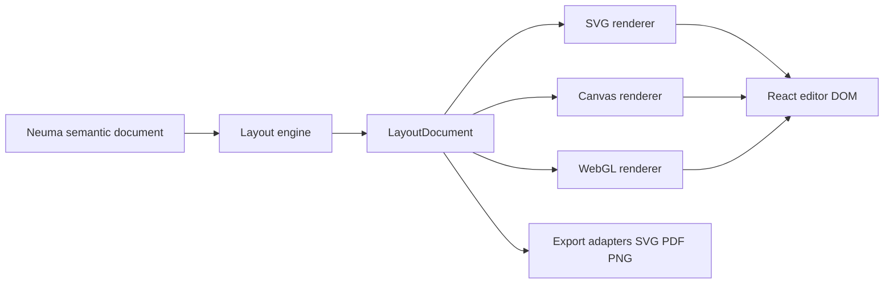
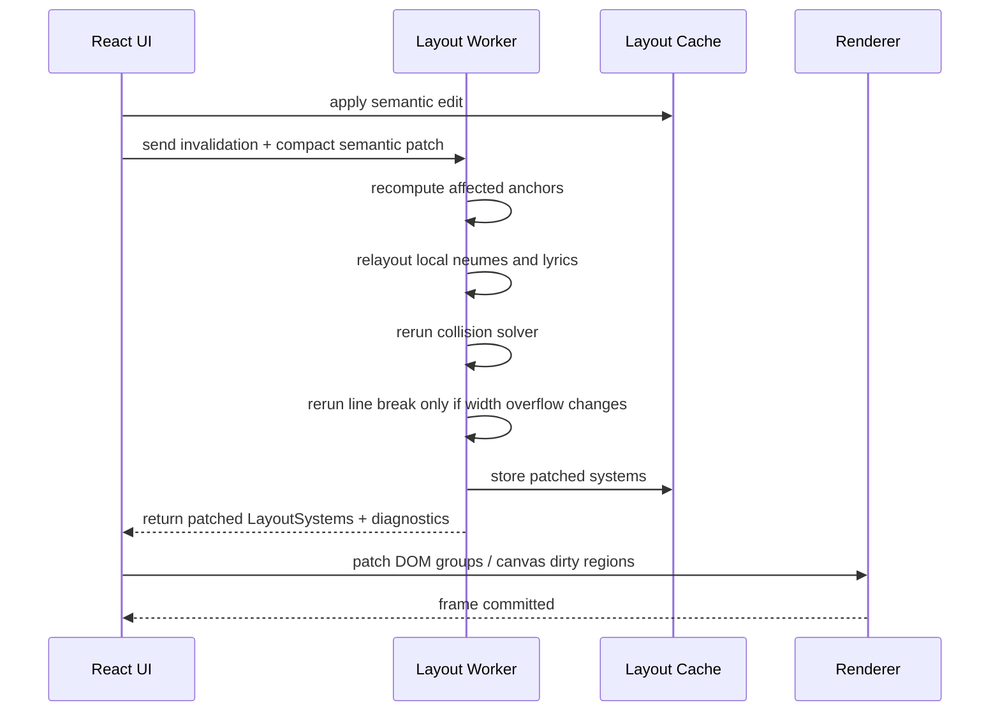

# Neuma Layout and Renderer Formats

## Executive summary

Neuma should use a **three stage graphics architecture**: a chant semantic document as the source of truth, a **deterministic layout IR** as the disposable positioning layer, and one or more **renderer back ends** fed either directly from the layout IR or from a flattened render instruction stream. This mirrors the most useful lessons from Verovio and Exsurge: Verovio separates semantic MEI from page and system layout while preserving element identity into SVG, and Exsurge follows a practical JavaScript sequence of parse, layout, line layout, then SVG generation. MEI also shows why syllables, layers, and facsimile mappings should remain distinct concerns rather than being collapsed into a single visual object. citeturn11view0turn15view0turn9view0turn9view3turn5search15

For Neuma’s **primary renderer**, the best default is **SVG first, with a hybrid escape hatch**. SVG is XML based, scales cleanly, sits naturally in the DOM, and can carry accessible names and descriptions; Verovio specifically exploits these properties to preserve musical structure and IDs in the browser. Canvas and WebGL remain valuable, but mostly as optional accelerators for overview panes, drag previews, or very large zoomed out scores, not as the first implementation of the score editor itself. Canvas is just a bitmap and is not semantically exposed to accessibility tools in the same way; WebGL is hardware accelerated and powerful, but adds substantial complexity for hit testing, text, export, and accessibility. citeturn6search0turn23view0turn11view0turn23view1turn25view0

The biggest performance wins will come from **layout and update strategy**, not from swapping SVG for GPU rendering too early. Gregorian chant editing is dominated by text underlay, line breaking, collision avoidance, clef and pitch remapping, and reflow after edits. Gregorio’s own documentation implicitly confirms this by exposing many spacing categories, manual line break controls, no line break areas, custos logic, and explicit caveats around polyphony and collision handling. That means Neuma should prioritise **incremental relayout by system**, **stable IDs**, **symbol reuse**, **glyph and text measurement caches**, **dirty region patching**, and **worker based layout** before attempting WebGL. citeturn4view2turn20view0turn20view1turn21view2turn23view2

The recommended MVP is therefore a **TypeScript layout engine in a Web Worker**, producing a `LayoutDocument` in abstract staff units; an **SVG renderer** using `<symbol>` and `<use>` for glyph reuse and stable `<g id="...">` wrappers for direct editor interaction; and a **Node based export path** that reuses the same layout engine to emit SVG and then PDF. Canvas should be added only for very specific workloads such as a minimap, fast transient previews, or raster export. WebGL should wait until profiling proves that SVG or Canvas genuinely bottlenecks the product. citeturn23view3turn21view2turn15view0turn11view0

## What existing systems imply for Neuma

MEI’s neume model is a strong semantic precedent, but not a sufficient editor model on its own. In the MEI neumes module, the **syllable is the fundamental structural unit**, the `syllable` element is the primary organisational element inside a `layer`, and a syllable may contain **one or more neumes**. MEI also keeps logical references to `layer`, `staff`, and `syl`, which is exactly the kind of separation Neuma needs for explicit alignment and multi voice extension. At the same time, MEI’s broader model distinguishes **score and parts** views and provides **facsimile surface and zone** machinery, showing that source mapping and visual rendering should remain separable rather than fused into the core semantic document. citeturn9view3turn5search15turn10view3turn5search16

Gregorio and GABC are invaluable as adapter formats, but their assumptions are too narrow to be Neuma’s native model. GABC is an ASCII notation for Gregorian chant; it centres notes under text using language specific vowel rules; it treats separation bars as separate syllable like units in the source notation; it supports automatic line breaks plus explicit forced breaks and no line break areas; and it generates custos automatically at line endings or inline before clef changes. These are useful import and export behaviours, but they are conventions of the adapter, not the semantics of the chant document. citeturn4view1turn19view0turn19view3turn20view0

The sharpest warning comes from Gregorio’s own polyphony notes. Gregorio admits that its notation is aimed at **one voice**, that multi level polyphonic typography is much harder, and that its simple one staff polyphony syntax ignores spacing for notes in curly braces and performs **no collision avoidance** between voices. That is exactly why Neuma should make **voice layers first class** in both its semantic IR and layout IR instead of encoding extra voices as a hack inside a monophonic syllable stream. citeturn20view0turn20view1

Exsurge is especially relevant because it demonstrates a viable **JavaScript chant rendering pipeline**. Its README shows a `ChantContext`, a chant score loaded from GABC, a layout pass, a line layout pass, and finally a method that returns SVG for insertion into the DOM. Neuma should preserve that practical shape, but with one important upgrade: the layout output should be an explicit, inspectable `LayoutDocument`, not an opaque object graph that is tightly coupled to one renderer. citeturn9view0

Verovio gives the clearest evidence for a modern browser facing notation engine. Verovio’s internal structure keeps a page and system organisation, supports both **positioned elements and automatic layout**, and deliberately preserves MEI IDs and hierarchy into SVG so that browser interaction becomes straightforward. Verovio also explicitly supports **server side**, **client side**, and **hybrid** deployment patterns. Those choices map almost perfectly to Neuma’s React plus Node architecture: layout must be deterministic and serialisable; SVG IDs must remain stable and semantically traceable; and export and editor rendering should share the same underlying engine. citeturn11view0turn15view0turn9view2

## Recommended layout architecture and TypeScript schema

The core architectural recommendation is to use **two derived visual layers** after the semantic document.

The first derived layer is a **retained layout IR** that knows where systems, staffs, neumes, notes, lyrics, bars, and clefs sit in abstract units, but still preserves semantic IDs and relationships. This is the layer React components should inspect for selection, hover, hit testing, inspector panels, and export preparation. The second derived layer is a **flattened render instruction stream** optimised for a specific painter such as SVG, Canvas 2D, or eventually WebGL. This follows Verovio’s evidence that preserving structure is valuable for interaction, while also acknowledging that immediate mode back ends benefit from flattened command buffers. citeturn11view0turn25view1turn25view0



A practical layout schema for Neuma should look like this:

```ts
export type Id = string

export interface Rect {
  x: number
  y: number
  width: number
  height: number
}

export interface Point {
  x: number
  y: number
}

export interface LayoutDocument {
  schema: "neuma.layout"
  version: string
  layoutId: Id
  sourceDocumentId: Id
  sourceRevision: string
  units: LayoutUnits
  viewport: {
    width: number
    height: number
    pageMode: "continuous" | "paged"
  }
  defs: LayoutGlyphDef[]
  systems: LayoutSystem[]
  renderHints: {
    preferredRenderer: "svg" | "canvas" | "webgl" | "hybrid"
    pixelSnap: boolean
    dprAware: boolean
  }
  index: {
    semanticToLayoutIds: Record<Id, Id[]>
    voiceToSystemIds: Record<Id, Id[]>
    textSpanToSyllableIds: Record<Id, Id[]>
  }
  diagnostics: LayoutDiagnostic[]
}

export interface LayoutUnits {
  kind: "staffSpace"
  /**
   * 1.0 means one staff space between adjacent staff lines.
   * All x/y/width/height values in the layout IR are expressed in this unit.
   */
  value: 1
  pxPerStaffSpace: number
  lineThickness: number
}

export interface LayoutGlyphDef {
  key: Id
  source: "font" | "path"
  glyphName?: string
  pathData?: string
  advanceWidth: number
  bbox: Rect
  opticalPadding: {
    left: number
    right: number
    top: number
    bottom: number
  }
}

export interface LayoutSystem {
  id: Id
  index: number
  surfaceIndex?: number
  rect: Rect
  contentRect: Rect
  staffSpace: number
  staffs: LayoutStaff[]
  neumes: LayoutNeume[]
  syllables: LayoutSyllable[]
  textRuns: LayoutTextRun[]
  glyphs: LayoutGlyph[]
  breakInfo: {
    kind: "auto" | "forced" | "page" | "keepTogether"
    justification: number
    widowPenaltyApplied: boolean
    orphanPenaltyApplied: boolean
    trailingCustos?: Id
  }
}

export interface LayoutStaff {
  id: Id
  semanticStaffId: Id
  voiceIds: Id[]
  origin: Point
  width: number
  lineCount: 4 | 5
  lineYs: number[]
  lineThickness: number
  ledgerSegments: Array<{
    x: number
    y: number
    width: number
  }>
  clefRuns: Array<{
    clefEventId: Id
    x: number
    glyphId: Id
    governsFromMusicEventId: Id
    governsToMusicEventId?: Id
  }>
}

export interface LayoutGlyph {
  id: Id
  semanticId?: Id
  parentId?: Id
  systemId: Id
  staffId?: Id
  defKey: Id
  kind:
    | "staffLine"
    | "clef"
    | "custos"
    | "barline"
    | "note"
    | "liquescent"
    | "quilisma"
    | "accidental"
    | "episema"
    | "mora"
    | "ictus"
    | "brace"
    | "editorialMark"
    | "selection"
    | "handle"
  x: number
  y: number
  width: number
  height: number
  zIndex: number
  classes: string[]
  styleKey?: string
  hitBox?: Rect
  reusable: boolean
}

export interface LayoutNeume {
  id: Id
  semanticNeumeId: Id
  voiceId: Id
  staffId: Id
  systemId: Id
  glyphIds: Id[]
  noteEventIds: Id[]
  rect: Rect
  anchor: {
    x: number
    y: number
  }
  textAttachment: {
    textSpanIds: Id[]
    relation: "syllabic" | "melisma" | "sharedGesture" | "coSung" | "editorialAssociation"
    visualAnchorX: number
    visualSpanX1: number
    visualSpanX2: number
  }
  collisionGroup: Id
}

export interface LayoutSyllable {
  id: Id
  semanticTextSpanId: Id
  systemId: Id
  wordId?: Id
  lyricRunId: Id
  translationRunIds?: Id[]
  attachedNeumeIds: Id[]
  bounds: Rect
  baselineY: number
  anchorPolicy: "vowelCentre" | "spanCentre" | "firstPrincipalNote" | "editorial"
  anchorX: number
  melismaExtent?: {
    startX: number
    endX: number
  }
  continuation: {
    softHyphenBefore: boolean
    softHyphenAfter: boolean
    lineBreakWithinWord: boolean
    elision: boolean
  }
}

export interface LayoutTextRun {
  id: Id
  role: "lyric" | "translation" | "annotation" | "aboveLine" | "commentary" | "editorial"
  text: string
  systemId: Id
  attachedTo?: {
    kind: "syllable" | "neume" | "system"
    id: Id
  }
  x: number
  y: number
  width: number
  height: number
  baselineY: number
  align: "left" | "centre" | "right"
  fontKey: string
  classes: string[]
}

export interface LayoutDiagnostic {
  severity: "info" | "warning" | "error"
  code: string
  message: string
  semanticIds?: Id[]
  layoutIds?: Id[]
}
```

A renderer friendly lowering format should then be a separate, flatter type:

```ts
export type RenderInstruction =
  | {
      op: "beginGroup"
      id: Id
      className?: string
      semanticId?: Id
      systemId?: Id
      transform?: string
    }
  | {
      op: "endGroup"
    }
  | {
      op: "useGlyph"
      id: Id
      defKey: Id
      x: number
      y: number
      className?: string
      semanticId?: Id
      hitBox?: Rect
    }
  | {
      op: "drawLine"
      id: Id
      x1: number
      y1: number
      x2: number
      y2: number
      className?: string
      semanticId?: Id
    }
  | {
      op: "drawRect"
      id: Id
      rect: Rect
      className?: string
      semanticId?: Id
    }
  | {
      op: "drawText"
      id: Id
      text: string
      x: number
      y: number
      align: "left" | "centre" | "right"
      className?: string
      semanticId?: Id
    }
  | {
      op: "setClipRect"
      id: Id
      rect: Rect
    }
```

The key design choice is that **`LayoutDocument` remains semantically rich**, while **`RenderInstruction[]` is painter oriented**. SVG can consume either layer directly; Canvas and WebGL should consume the flattened instruction stream or an even lower glyph batch representation. This avoids the common mistake of forcing the editor to reason entirely in terms of paths and pixels. Verovio’s preservation of IDs into SVG strongly supports keeping semantic traceability all the way into the visual layers. citeturn11view0

## Spacing, underlay, and line breaking rules

A chant editor cannot get away with a generic music spacing engine. Chant spacing is deeply tied to syllable underlay, neume grouping, bars, and clef behaviour. Gregorio’s spacing table is revealing here: it distinguishes inter glyph space, inter element space, inter syllable note space, clef gaps, sign spacing, custos spacing, word spacing, finalis spacing, and several special cases for puncta inclinata and virgae. Neuma should **not** reproduce every Gregorio constant one to one, but it should adopt the same principle that chant spacing is a family of related spacing policies rather than one global note spacing value. citeturn4view2

### A practical metric system

For Neuma, the simplest unit system is:

```ts
type LayoutMetricDefaults = {
  staffSpace: 1.0
  noteStep: 0.5             // line to adjacent space
  lineThickness: 0.08
  minInterGlyphGap: 0.22
  minInterElementGap: 0.28
  minInterNeumeGroupGap: 0.55
  minInterSyllableGap: 1.0
  minWordGap: 1.25
  clefAfterGap: 0.95
  accidentalAfterGap: 0.30
  eolCustosBeforeGap: 0.70
  inlineCustosBeforeGap: 0.20
  minorBarPadding: 0.55
  majorBarPadding: 0.85
  finalBarPadding: 1.10
  lyricStaffGap: 1.35
  translationGapBelowLyric: 0.75
  annotationGapAboveStaff: 0.8
}
```

These are **recommended Neuma defaults**, not historical absolutes. They deliberately compress Gregorio’s many categories into a smaller set that is easier to tune in a browser codebase while still respecting the categories Gregorio deems important. If you later want house styles, create a `SpacingProfile` registry and map house rules into these fields. citeturn4view2

### Staff spacing and glyph grouping

Historically and in modern squared notation, chant is normally rendered on a **four line staff** with movable **C and F clefs**; GABC reflects this by encoding clef shape and line number, and Gregorio also supports inline custos before clef changes. Neuma should therefore place staff geometry on `LayoutStaff`, keep clef changes as ordinary semantic music events, and let layout generate the corresponding `clefRuns`, inline custos, and pitch remapping ranges. Do not bake pitch to y coordinates earlier than layout. citeturn19view0turn20view0turn13search13

Neume spacing should operate in three nested layers. Inside a **glyph recipe**, the renderer uses the font or path metrics for tightly connected components. Between **neume elements within one syllable**, use a distinct inter neume group gap, large enough to preserve the visual sense of a cut. Between **syllables**, enforce a larger minimum gap because lyric legibility matters more than compactness. Gregorio’s abandoned but still informative “structure of Gregorian chant notation” document is useful here: it distinguishes between neumes, neumatic elements, and neumatic glyphs, and explicitly motivates glyph level composition for typography. That is a good fit for Neuma’s `LayoutGlyphDef` plus `LayoutNeume` split. citeturn18view0turn4view2

### Syllable underlay and text anchoring

Gregorio’s documentation makes clear that note to text centring matters and that default centring depends on language specific vowel rules. Neuma should keep that idea, but make it explicit and inspectable: every `LayoutSyllable` should store an `anchorPolicy` and an `anchorX`. The default rule for Latin lyrics should be **vowel nucleus centred over the principal note anchor**. On import from GABC, record the imported language and the resolved lyric anchor so that round trips remain stable even if your own text anchor algorithm later changes. citeturn19view3

For **one syllable with one neume**, centre the lyric anchor on the neume’s principal anchor. For **one syllable with multiple neume groups**, keep one lyric run, set `attachedNeumeIds` to all groups, place the visible lyric under the **first principal note group by default**, and record a `melismaExtent` spanning the first and last attached group so selection and editing reflect the full ownership. This aligns with MEI’s statement that a syllable may be expressed via one or more neumes, while avoiding the editor confusion of floating text centred across a very long melisma. citeturn9view3

For **multiple voices on the same syllable**, the syllable should still appear once in layout, but `attachedNeumeIds` should contain one neume per voice and `relation` should be `coSung`. The text anchor stays single; the owned music span becomes the union of both voice ranges. This is where Neuma intentionally diverges from GABC’s limited polyphony conventions. Gregorio’s simple curly brace polyphony relies on manual spacing and offers no collision handling, so Neuma should instead model voice lanes and let collision resolution operate across lanes. citeturn20view0turn20view1

### Melismas, elisions, hyphenation, and line endings

For a **melisma**, define the visual extent from the first attached note anchor to the last attached note anchor, and carry that span in `LayoutSyllable.melismaExtent`. This matters for hover and selection, but also for line breaking because the system ending must reserve room for a custos and optionally preserve a visually coherent end of melismatic gesture. MEI’s statement that a syllable may be expressed via one or more neumes is the semantic basis; the layout span is Neuma’s explicit editor facing addition. citeturn9view3

For **elisions**, Gregorio treats `<e>...</e>` text as a syllable without associated notes, styled separately and ignored by its vowel finding algorithm. Neuma should keep elision as a text level concept in the semantic document, then emit `LayoutSyllable.continuation.elision = true` and a dedicated `LayoutTextRun` class so the renderer can italicise or downsize it without pretending it has its own independent neume attachment. citeturn20view0

For **hyphenation**, do not inherit GABC’s weakness where a line break in the middle of a word may require a manually inserted hyphen in the source file. Instead, keep lexical hyphens in the semantic text, compute **soft continuation hyphens in layout**, and mark them in `LayoutSyllable.continuation`. That keeps source fidelity and visual correctness separate, which is exactly the kind of separation Neuma is supposed to improve on. citeturn4view2

### Bars, phrase structure, custos, and line breaking

GABC currently forces a bar between syllables to be encoded as a separate syllable like object, which is a source notation compromise, not a good internal model. Neuma should represent bars as **semantic phrase events** with optional structural labels and break affinities. The layout engine should then position them in staff space without converting them into fake lyrics. This is one of the clearest places where Neuma must reject a GABC shaped IR. citeturn19view0turn19view1

Custos should be computed automatically in layout, not stored in the semantic document except as an editorial override. Gregorio generates end of line custos from the first note on the next line and inline custos before clef changes. Neuma should do the same, but store them only as `LayoutGlyph` objects keyed to the relevant break decision. That makes custos disposable and keeps the semantic document free of page and line artefacts. citeturn20view0turn20view1

A strong default line breaking heuristic for chant is a **penalty based system** over syllable boundaries and bar events. Hard constraints should ban breaks inside user locked no break spans, inside atomic voice bundles that must remain aligned, or between an elision and its host syllable. Soft preferences should favour breaks after stronger bars, discourage breaks that would leave very short last systems, and penalise breaks that separate a clef change from the music it governs. Gregorio’s line break advice and penalty based spacing configuration strongly support this approach, even though Neuma should implement it more explicitly than GABC can encode. citeturn4view2turn20view1

### Collision resolution

Collision handling is where Neuma can most obviously exceed Gregorio and Exsurge. The minimum solver should run in this order: note glyphs and staff, then note modifiers, then lyrics, then above line text, then editorial overlays, then selection handles. Resolve collisions **locally first** by expanding the smallest affected spacing bucket, then escalate to **system justification** only if local relaxation fails; trigger **line rebreak** only when spacing would exceed a maximum stretch threshold. Gregorio’s own documentation shows why this matters: its simple polyphony leaves collision avoidance to the user. Neuma should not. citeturn20view0turn20view1

## Renderer formats and trade offs

The comparison below is an **analytical synthesis** of SVG’s DOM and accessibility model, Canvas’s bitmap and worker friendly model, WebGL’s hardware accelerated canvas based pipeline, and the deployment patterns showcased by Verovio. The factual substrate comes from MDN, W3C, web.dev, and the Verovio book; the ratings are implementation recommendations for Neuma. citeturn6search0turn23view0turn23view1turn25view1turn25view0turn15view0

| Attribute | SVG | Canvas 2D | WebGL | Hybrid |
|---|---|---|---|---|
| Fidelity for chant glyphs | Excellent | Good to very good | Good, but text and crisp path work need more machinery | Excellent if SVG handles score and canvas handles previews |
| DOM interactivity | Excellent | Weak by default | Weak by default | Strong where SVG remains the semantic surface |
| Accessibility | Strong with inline DOM, `role`, `title`, `desc` | Weak unless mirrored with fallback DOM | Weak unless mirrored with fallback DOM | Strong if semantic SVG layer remains present |
| Export to SVG/PDF | Native | Needs raster export or separate vector path | Needs custom export path | Strong if SVG remains canonical export |
| Performance with small to medium documents | Excellent | Excellent | Excellent | Excellent |
| Performance with very many visible primitives | Fair to good | Good to excellent | Excellent | Good to excellent |
| Memory profile | Higher retained DOM overhead | Lower scene memory, higher redraw work | Lower per instance scene memory, higher GPU setup complexity | Medium |
| First implementation complexity | Low | Medium | High | Medium |
| Text rendering complexity | Low | Medium | High | Medium |
| Stable element IDs | Natural | Synthetic only | Synthetic only | Natural for SVG layer |
| Best use in Neuma | Main editor and exports | Minimap, drag preview, raster preview | Future zoomed out atlas renderer only | Recommended architecture |

For Neuma specifically, the right choice is **hybrid architecture with SVG as the canonical score surface**. Use SVG for the main editor score because it gives you element addressability, clean scaling, accessibility hooks, and easy export. Use a small Canvas layer only for transient effects that should not mutate the retained DOM, such as rubber band selection rectangles, drag shadows, playback cursors, and overview thumbnails. Keep WebGL out of the MVP. The likely performance ceiling of a chant editor is not millions of noteheads per frame; it is the cost of text and layout churn after edits. citeturn11view0turn23view0turn23view1turn25view0turn20view0

Server and client responsibilities should also be split deliberately.

| Concern | Client in React | Server in Node/Express |
|---|---|---|
| Immediate editing latency | Primary | Not suitable for each keystroke |
| Full deterministic export | Optional preview only | Primary |
| Live hit testing | Primary | None |
| PDF generation | Optional but awkward | Primary |
| Cached shareable SVG snapshots | Optional | Primary |
| Large batch conversion | No | Primary |

Verovio explicitly supports server side, client side, and hybrid modes, and for Neuma the same pattern applies. Client side layout is the priority for editing responsiveness; server side layout is the priority for export fidelity, reproducible snapshots, and batch jobs. citeturn15view0

## Performance strategy and optimisation plan

The main rule is simple: **optimise the layout engine first, the renderer second**. In a chant editor, changing one lyric syllable can invalidate text anchoring, melisma extents, collisions, bar spacing, and system breaks. By contrast, painting a few thousand vector elements is often cheap enough if the DOM tree is disciplined. Verovio’s need to rerun layout when page dimensions or scaling change, and Gregorio’s abundance of spacing and break controls, both point to layout as the dominant strategic bottleneck. citeturn9view2turn4view2

### What to prioritise

Prioritise speed in this order:

| Priority | Why it matters most | Recommendation |
|---|---|---|
| Incremental layout invalidation | Most edits affect only one local region plus dependent breaks | Relayout by system window, not whole document |
| Text measurement and anchoring | Lyric placement drives chant usability | Cache by font, text, style, language |
| Collision resolution | Poly voice and editorial overlays add local complexity | Solve locally before rebreaking |
| DOM patch size | SVG remains fast if patches stay local | Stable `<g>` IDs and keyed React portals |
| Threading | Main thread jank harms the editor immediately | Run layout in a Worker |
| GPU acceleration | Useful later, rarely first order for chant | Defer WebGL until profiling says otherwise |

The best threading pattern is a **single layout worker** that receives compact invalidation requests and returns a new `LayoutDocument` or per system patches. MDN notes that Web Workers move heavy work off the main execution thread, and OffscreenCanvas lets canvas work also happen in a worker. When worker traffic gets large, use **transferable objects** rather than repeatedly cloning large buffers, because transferred `ArrayBuffer` resources move in a fast zero copy operation instead of being duplicated. citeturn7search3turn6search2turn23view2

### Concrete optimisation techniques

For SVG, define glyphs once and instantiate them many times. MDN’s `<use>` element duplicates referenced nodes, and `<symbol>` exists specifically for reusable graphical templates. For a chant engine, that means using a symbol library for puncta, virgae, clefs, flat signs, custos bodies, and editorial handles. Wrap semantic objects such as neumes and syllables in stable `<g>` elements that carry the real IDs, and place repeated visual primitives inside those groups with `<use>`. That keeps interaction simple while reducing repeated path payload. citeturn23view3turn16search5

For Canvas 2D, pre render repeated primitives and reuse path objects. MDN recommends pre rendering similar or repeating objects on an offscreen canvas, using layered canvases for scenes with both static and dynamic parts, batching calls, avoiding unnecessary state changes, and rendering only screen differences rather than the whole new state. The `Path2D` API exists specifically to retain and replay paths, which makes it a good fit for repeated neume recipes or selection handles. citeturn21view1turn24view0

For responsiveness, tie visual updates to `requestAnimationFrame()` and size sensitive relayout to `ResizeObserver`. `requestAnimationFrame()` aligns drawing with the next repaint and follows the display refresh rate, while `ResizeObserver` reports changes to element and SVG bounding boxes. In practice, that means: schedule DOM or canvas patching on the next animation frame, but debounce relayout so that a burst of resizes or drags collapses into one worker request per frame. citeturn24view1turn16search3

For long documents, use **virtualised systems**. Verovio explicitly notes that for complex large datasets only subsets can reasonably be visualised at a time. Neuma should therefore mount only the visible systems plus a small overscan window, while keeping the full semantic document and layout cache in memory. This matters more for long antiphonaries or classroom annotation documents than for a single short chant, but the architecture should support it from the start. citeturn15view0

For screen quality, make all renderers **DPR aware**. MDN recommends scaling canvas backing store by `devicePixelRatio` so drawings do not blur on high resolution displays. For SVG, keep a stable logical coordinate system and let `viewBox` handle scaling; Verovio recommends exactly this style of responsive SVG embedding. citeturn21view1turn9view2

### Incremental update model

A good invalidation model for Neuma is:

```ts
export interface LayoutInvalidation {
  cause:
    | "textEdit"
    | "pitchEdit"
    | "voiceEdit"
    | "spacingStyleChange"
    | "viewportResize"
    | "selectionOnly"
  semanticIds: Id[]
  affectedVoices: Id[]
  preferredSystemWindow?: {
    fromSystemIndex: number
    toSystemIndex: number
  }
}
```

Then implement these rules:

```ts
type UpdateScope =
  | "none"          // selection, hover only
  | "paintOnly"     // class/style mutation only
  | "systemLocal"   // relayout current system
  | "systemWindow"  // relayout current + neighbours
  | "fromChangeToEnd" // if rebreaking cascades
  | "fullDocument"  // spacing profile / font / page width change
```

A **timeline for incremental rendering** should look like this:



### Where WASM can help

Do **not** begin with WASM. Start with TypeScript, measure, then isolate hotspots. If Neuma later needs WASM, the strongest candidates are the **line break optimiser**, **collision solver**, and perhaps **glyph recipe expansion** for huge documents. These are algorithmic, numeric, and relatively self contained. The renderer itself is a weaker candidate because browser native SVG and Canvas already do the final drawing, and the real challenge is usually scene graph churn, not arithmetic. WebGL or WebGPU only become attractive when you are instancing enormous numbers of primitives, which is atypical for chant editing compared with map or chart workloads. citeturn25view0turn21view2turn11view0

## Concrete examples and MVP defaults

The following example shows a **short monophonic phrase** laid out as one system. The numbers are illustrative rather than font exact.

```json
{
  "schema": "neuma.layout",
  "version": "0.1.0",
  "layoutId": "lay_001",
  "sourceDocumentId": "doc_kyrie",
  "sourceRevision": "42",
  "units": {
    "kind": "staffSpace",
    "value": 1,
    "pxPerStaffSpace": 10,
    "lineThickness": 0.08
  },
  "viewport": {
    "width": 72,
    "height": 18,
    "pageMode": "continuous"
  },
  "defs": [
    { "key": "punctum", "source": "font", "glyphName": "punctum", "advanceWidth": 0.8, "bbox": { "x": 0, "y": 0, "width": 0.8, "height": 0.8 }, "opticalPadding": { "left": 0.05, "right": 0.05, "top": 0.05, "bottom": 0.05 } },
    { "key": "virga", "source": "font", "glyphName": "virga", "advanceWidth": 0.9, "bbox": { "x": 0, "y": 0, "width": 0.9, "height": 1.5 }, "opticalPadding": { "left": 0.05, "right": 0.05, "top": 0.1, "bottom": 0.05 } },
    { "key": "divisioMinima", "source": "font", "glyphName": "divisioMinima", "advanceWidth": 0.5, "bbox": { "x": 0, "y": 0, "width": 0.5, "height": 3.2 }, "opticalPadding": { "left": 0.1, "right": 0.1, "top": 0, "bottom": 0 } }
  ],
  "systems": [
    {
      "id": "sys_1",
      "index": 0,
      "rect": { "x": 4, "y": 2, "width": 60, "height": 12 },
      "contentRect": { "x": 6, "y": 2, "width": 56, "height": 12 },
      "staffSpace": 1,
      "staffs": [
        {
          "id": "staff_1",
          "semanticStaffId": "main_staff",
          "voiceIds": ["voice_1"],
          "origin": { "x": 6, "y": 3 },
          "width": 56,
          "lineCount": 4,
          "lineYs": [3, 4, 5, 6],
          "lineThickness": 0.08,
          "ledgerSegments": [],
          "clefRuns": [
            { "clefEventId": "clef_c3", "x": 6.2, "glyphId": "g_clef_1", "governsFromMusicEventId": "n_ky_1" }
          ]
        }
      ],
      "neumes": [
        {
          "id": "ln_ky",
          "semanticNeumeId": "neume_ky",
          "voiceId": "voice_1",
          "staffId": "staff_1",
          "systemId": "sys_1",
          "glyphIds": ["g_ky_1", "g_ky_2"],
          "noteEventIds": ["n_ky_1", "n_ky_2"],
          "rect": { "x": 12, "y": 3.2, "width": 2.0, "height": 2.1 },
          "anchor": { "x": 12.9, "y": 4.0 },
          "textAttachment": {
            "textSpanIds": ["span_ky"],
            "relation": "syllabic",
            "visualAnchorX": 12.9,
            "visualSpanX1": 12.0,
            "visualSpanX2": 14.0
          },
          "collisionGroup": "cg_ky"
        },
        {
          "id": "ln_ri",
          "semanticNeumeId": "neume_ri",
          "voiceId": "voice_1",
          "staffId": "staff_1",
          "systemId": "sys_1",
          "glyphIds": ["g_ri_1", "g_ri_2"],
          "noteEventIds": ["n_ri_1", "n_ri_2"],
          "rect": { "x": 18, "y": 3.6, "width": 1.8, "height": 1.8 },
          "anchor": { "x": 18.8, "y": 4.2 },
          "textAttachment": {
            "textSpanIds": ["span_ri"],
            "relation": "syllabic",
            "visualAnchorX": 18.8,
            "visualSpanX1": 18.0,
            "visualSpanX2": 19.8
          },
          "collisionGroup": "cg_ri"
        },
        {
          "id": "ln_e",
          "semanticNeumeId": "neume_e",
          "voiceId": "voice_1",
          "staffId": "staff_1",
          "systemId": "sys_1",
          "glyphIds": ["g_e_1", "g_e_2", "g_e_3"],
          "noteEventIds": ["n_e_1", "n_e_2", "n_e_3"],
          "rect": { "x": 24, "y": 3.0, "width": 3.4, "height": 2.8 },
          "anchor": { "x": 24.9, "y": 3.8 },
          "textAttachment": {
            "textSpanIds": ["span_e"],
            "relation": "melisma",
            "visualAnchorX": 24.9,
            "visualSpanX1": 24.0,
            "visualSpanX2": 27.4
          },
          "collisionGroup": "cg_e"
        }
      ],
      "syllables": [
        {
          "id": "ls_ky",
          "semanticTextSpanId": "span_ky",
          "systemId": "sys_1",
          "lyricRunId": "txt_ky",
          "attachedNeumeIds": ["ln_ky"],
          "bounds": { "x": 11.8, "y": 7.2, "width": 2.2, "height": 1.2 },
          "baselineY": 8.0,
          "anchorPolicy": "vowelCentre",
          "anchorX": 12.9,
          "continuation": {
            "softHyphenBefore": false,
            "softHyphenAfter": true,
            "lineBreakWithinWord": false,
            "elision": false
          }
        },
        {
          "id": "ls_ri",
          "semanticTextSpanId": "span_ri",
          "systemId": "sys_1",
          "lyricRunId": "txt_ri",
          "attachedNeumeIds": ["ln_ri"],
          "bounds": { "x": 17.8, "y": 7.2, "width": 2.1, "height": 1.2 },
          "baselineY": 8.0,
          "anchorPolicy": "vowelCentre",
          "anchorX": 18.8,
          "continuation": {
            "softHyphenBefore": false,
            "softHyphenAfter": true,
            "lineBreakWithinWord": false,
            "elision": false
          }
        },
        {
          "id": "ls_e",
          "semanticTextSpanId": "span_e",
          "systemId": "sys_1",
          "lyricRunId": "txt_e",
          "attachedNeumeIds": ["ln_e"],
          "bounds": { "x": 24.5, "y": 7.2, "width": 0.9, "height": 1.2 },
          "baselineY": 8.0,
          "anchorPolicy": "firstPrincipalNote",
          "anchorX": 24.9,
          "melismaExtent": {
            "startX": 24.0,
            "endX": 27.4
          },
          "continuation": {
            "softHyphenBefore": false,
            "softHyphenAfter": false,
            "lineBreakWithinWord": false,
            "elision": false
          }
        }
      ],
      "textRuns": [
        { "id": "txt_ky", "role": "lyric", "text": "Ky", "systemId": "sys_1", "attachedTo": { "kind": "syllable", "id": "ls_ky" }, "x": 11.9, "y": 8.0, "width": 2.0, "height": 1.0, "baselineY": 8.0, "align": "centre", "fontKey": "lyricMain", "classes": ["lyric"] },
        { "id": "txt_ri", "role": "lyric", "text": "ri", "systemId": "sys_1", "attachedTo": { "kind": "syllable", "id": "ls_ri" }, "x": 17.9, "y": 8.0, "width": 1.8, "height": 1.0, "baselineY": 8.0, "align": "centre", "fontKey": "lyricMain", "classes": ["lyric"] },
        { "id": "txt_e", "role": "lyric", "text": "e", "systemId": "sys_1", "attachedTo": { "kind": "syllable", "id": "ls_e" }, "x": 24.5, "y": 8.0, "width": 0.8, "height": 1.0, "baselineY": 8.0, "align": "centre", "fontKey": "lyricMain", "classes": ["lyric"] }
      ],
      "glyphs": [
        { "id": "g_clef_1", "semanticId": "clef_c3", "systemId": "sys_1", "staffId": "staff_1", "defKey": "clefC3", "kind": "clef", "x": 6.2, "y": 4.5, "width": 1.0, "height": 2.2, "zIndex": 1, "classes": ["clef"], "reusable": true },
        { "id": "g_ky_1", "semanticId": "n_ky_1", "systemId": "sys_1", "staffId": "staff_1", "parentId": "ln_ky", "defKey": "punctum", "kind": "note", "x": 12.0, "y": 4.5, "width": 0.8, "height": 0.8, "zIndex": 2, "classes": ["note"], "reusable": true },
        { "id": "g_ky_2", "semanticId": "n_ky_2", "systemId": "sys_1", "staffId": "staff_1", "parentId": "ln_ky", "defKey": "virga", "kind": "note", "x": 13.0, "y": 4.0, "width": 0.9, "height": 1.5, "zIndex": 2, "classes": ["note", "virga"], "reusable": true }
      ],
      "breakInfo": {
        "kind": "auto",
        "justification": 0.09,
        "widowPenaltyApplied": false,
        "orphanPenaltyApplied": false
      }
    }
  ],
  "renderHints": {
    "preferredRenderer": "svg",
    "pixelSnap": false,
    "dprAware": true
  },
  "index": {
    "semanticToLayoutIds": {
      "span_ky": ["ls_ky", "ln_ky"],
      "span_ri": ["ls_ri", "ln_ri"],
      "span_e": ["ls_e", "ln_e"]
    },
    "voiceToSystemIds": {
      "voice_1": ["sys_1"]
    },
    "textSpanToSyllableIds": {
      "span_ky": ["ls_ky"],
      "span_ri": ["ls_ri"],
      "span_e": ["ls_e"]
    }
  },
  "diagnostics": []
}
```

A corresponding render instruction fragment might look like this:

```json
[
  { "op": "beginGroup", "id": "sys_1", "className": "system" },

  { "op": "drawLine", "id": "staff_1_l1", "x1": 6, "y1": 3, "x2": 62, "y2": 3, "className": "staff-line", "semanticId": "main_staff" },
  { "op": "drawLine", "id": "staff_1_l2", "x1": 6, "y1": 4, "x2": 62, "y2": 4, "className": "staff-line", "semanticId": "main_staff" },
  { "op": "drawLine", "id": "staff_1_l3", "x1": 6, "y1": 5, "x2": 62, "y2": 5, "className": "staff-line", "semanticId": "main_staff" },
  { "op": "drawLine", "id": "staff_1_l4", "x1": 6, "y1": 6, "x2": 62, "y2": 6, "className": "staff-line", "semanticId": "main_staff" },

  { "op": "useGlyph", "id": "g_clef_1", "defKey": "clefC3", "x": 6.2, "y": 4.5, "className": "clef", "semanticId": "clef_c3" },

  { "op": "beginGroup", "id": "ln_ky", "className": "neume", "semanticId": "neume_ky" },
  { "op": "useGlyph", "id": "g_ky_1", "defKey": "punctum", "x": 12.0, "y": 4.5, "className": "note", "semanticId": "n_ky_1" },
  { "op": "useGlyph", "id": "g_ky_2", "defKey": "virga", "x": 13.0, "y": 4.0, "className": "note virga", "semanticId": "n_ky_2" },
  { "op": "endGroup" },

  { "op": "drawText", "id": "txt_ky", "text": "Ky", "x": 12.9, "y": 8.0, "align": "centre", "className": "lyric", "semanticId": "span_ky" },
  { "op": "drawText", "id": "txt_ri", "text": "ri", "x": 18.8, "y": 8.0, "align": "centre", "className": "lyric", "semanticId": "span_ri" },
  { "op": "drawText", "id": "txt_e", "text": "e", "x": 24.9, "y": 8.0, "align": "centre", "className": "lyric", "semanticId": "span_e" },

  { "op": "endGroup" }
]
```

The next example demonstrates the feature that GABC cannot represent cleanly as a native semantic model: **two independent neumes, on two voices, attached to one syllable**. Gregorio’s workaround syntax for simple polyphony explicitly ignores spacing of one voice and leaves collision avoidance to the user, so this is the exact kind of document Neuma should represent natively. citeturn20view0turn20view1

```json
{
  "systemId": "sys_mv_1",
  "staffs": [
    {
      "id": "staff_mv",
      "semanticStaffId": "staff_main",
      "voiceIds": ["voice_upper", "voice_lower"],
      "origin": { "x": 6, "y": 3 },
      "width": 30,
      "lineCount": 4,
      "lineYs": [3, 4, 5, 6],
      "lineThickness": 0.08,
      "ledgerSegments": [],
      "clefRuns": []
    }
  ],
  "neumes": [
    {
      "id": "ln_upper",
      "semanticNeumeId": "neume_upper",
      "voiceId": "voice_upper",
      "staffId": "staff_mv",
      "systemId": "sys_mv_1",
      "glyphIds": ["gu1", "gu2"],
      "noteEventIds": ["u1", "u2"],
      "rect": { "x": 14.0, "y": 3.0, "width": 2.0, "height": 1.8 },
      "anchor": { "x": 14.9, "y": 3.8 },
      "textAttachment": {
        "textSpanIds": ["span_ky"],
        "relation": "coSung",
        "visualAnchorX": 14.9,
        "visualSpanX1": 14.0,
        "visualSpanX2": 16.0
      },
      "collisionGroup": "cg_mv"
    },
    {
      "id": "ln_lower",
      "semanticNeumeId": "neume_lower",
      "voiceId": "voice_lower",
      "staffId": "staff_mv",
      "systemId": "sys_mv_1",
      "glyphIds": ["gl1", "gl2"],
      "noteEventIds": ["l1", "l2"],
      "rect": { "x": 14.0, "y": 4.4, "width": 2.0, "height": 1.8 },
      "anchor": { "x": 14.9, "y": 5.2 },
      "textAttachment": {
        "textSpanIds": ["span_ky"],
        "relation": "coSung",
        "visualAnchorX": 14.9,
        "visualSpanX1": 14.0,
        "visualSpanX2": 16.0
      },
      "collisionGroup": "cg_mv"
    }
  ],
  "syllables": [
    {
      "id": "ls_mv_ky",
      "semanticTextSpanId": "span_ky",
      "systemId": "sys_mv_1",
      "lyricRunId": "txt_mv_ky",
      "attachedNeumeIds": ["ln_upper", "ln_lower"],
      "bounds": { "x": 14.0, "y": 7.3, "width": 1.8, "height": 1.0 },
      "baselineY": 8.0,
      "anchorPolicy": "spanCentre",
      "anchorX": 14.9,
      "continuation": {
        "softHyphenBefore": false,
        "softHyphenAfter": false,
        "lineBreakWithinWord": false,
        "elision": false
      }
    }
  ]
}
```

For the MVP, the recommended defaults are straightforward:

| Area | Recommended default |
|---|---|
| Main score surface | Inline SVG |
| Layout execution | Web Worker |
| Layout granularity | System based |
| Renderer identity model | Stable semantic IDs copied into layout and SVG |
| Glyph strategy | `<symbol>` plus `<use>` in SVG |
| Text placement | Explicit anchor per `LayoutSyllable` |
| Collision handling | Local greedy solver with bounded stretch |
| Export | Server side SVG, then PDF from SVG |
| Canvas use | Minimap, drag preview, playback cursor layer |
| WebGL use | None in MVP |

The main pitfalls to avoid are these. Do not put screen coordinates back into the semantic chant document. Do not make syllables and neumes the same object. Do not encode GABC bar and polyphony workarounds as native document semantics. Do not tie layout node IDs to array indexes. Do not measure text in React render functions. Do not rerender the entire SVG tree when a single system changed. Do not send giant nested object graphs to workers when compact patches or transferable buffers will do. And do not introduce WebGL before you have profiled a real document and can prove that layout and DOM patching are no longer the limiting factors. These recommendations follow directly from the failure modes visible in GABC’s adapter conventions, from Verovio’s ID preserving SVG model, and from current browser guidance on canvas, workers, and transferables. citeturn19view0turn20view0turn11view0turn21view1turn23view2